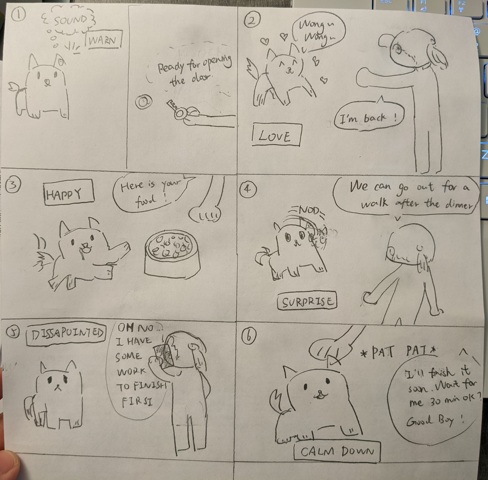
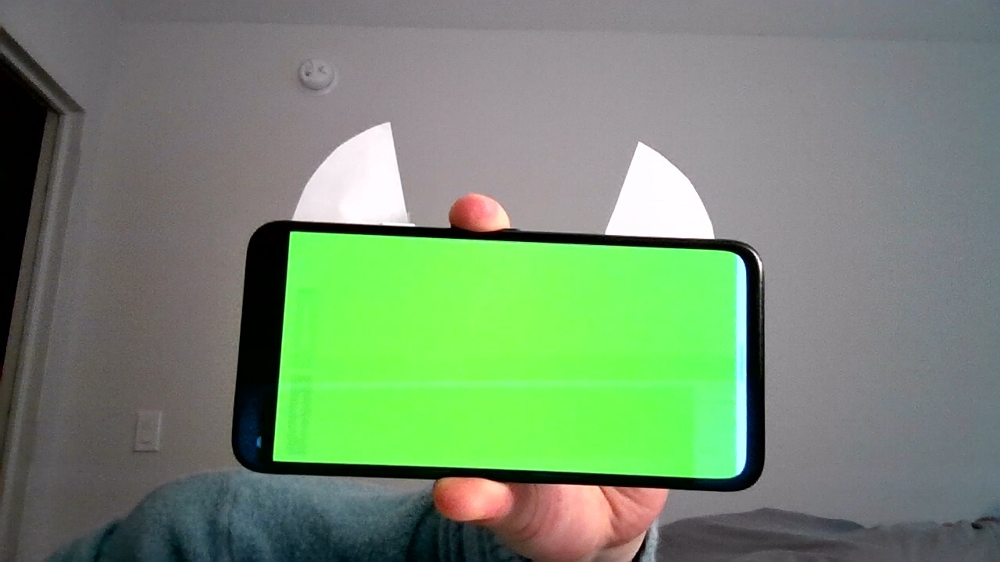
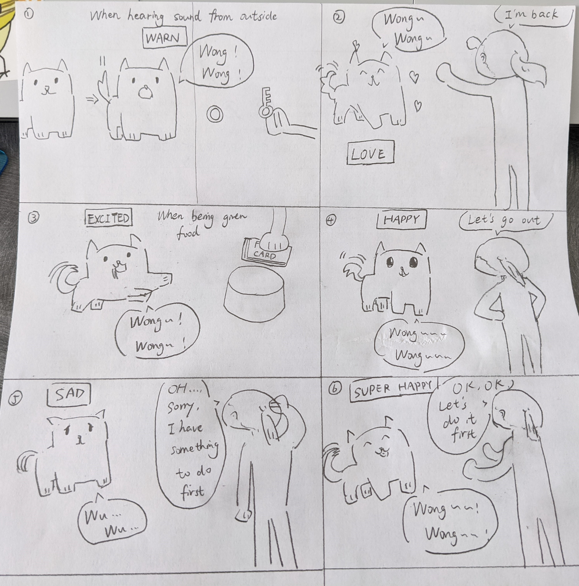

# Staging Interaction

In the original stage production of Peter Pan, Tinker Bell was represented by a darting light created by a small handheld mirror off-stage, reflecting a little circle of light from a powerful lamp. Tinkerbell communicates her presence through this light to the other characters. See more info [here](https://en.wikipedia.org/wiki/Tinker_Bell). 

There is no actor that plays Tinkerbell--her existence in the play comes from the interactions that the other characters have with her.

For lab this week, we draw on this and other inspirations from theatre to stage interactions with a device where the main mode of display/output for the interactive device you are designing is lighting. You will plot the interaction with a storyboard, and use your computer and a smartphone to experiment with what the interactions will look and feel like. _Make sure you read all the instructions and understand the whole of the laboratory activity before starting!_

### Deliverables for this lab are: 
1. Storyboard
1. Sketches/photos of costumed device
1. Any reflections you have on the process.
1. Video sketch of the prototyped interaction.
1. Submit these in the lab1 folder of your class [Github page], either as links or uploaded files. Each group member should post their own copy of the work to their own Lab Hub, even if some of the work is the same for each person in the group.

## Overview
For this assignment, you are going to 

A) [Plan](#part-a-plan) 

B) [Act out the interaction](#part-b-act-out-the-interaction) 

C) [Prototype the device](#part-c-prototype-the-device)

D) [Wizard the device](#part-d-wizard-the-device) 

E) [Costume the device](#part-e-costume-the-device)

F) [Record the interaction](#part-f-record)

## The Report
This readme.md page in your own repository should be edited to include the work you have done. You can delete everything but the headers and the sections between the **stars**. Write the answers to the questions under the starred sentences. Include any material that explains what you did in this lab hub folder, and link it in the readme.

Labs are due on Mondays. Make sure this page is linked to on your main class hub page.

## Part A. Plan 

**Describe your setting, players, activity and goals here.**

_Setting:_ 
The interaction happened in a house. The host Yanjun has just came back home after finishing a day's work. 

_Players:_ 
Host Yanjun and her virtual pet dog performed by the mobile phone are involved in this interaction.

_Activity:_ 
Yanjun says some words to the dog and gave it some interactions like patting. The dog will respond with light color as its mood indicator. Given with these feedbacks, Yanjun will make further interaction with it.

_Goals:_
The goal of the player Yanjun is to interact with her pet dog.

**Include a picture of your storyboard here**

## Part B. Act out the Interaction

**Are there things that seemed better on paper than acted out?**

Reaction rehearsal is continuously in mind but needs more care when it comes to real action. Filming and controlling the light by the same person is extremely hard. A proper scence design which fully takes in the actor and the mobile phone needs a bit more consideration then I expected. 

## Part C. Prototype the device

**Give us feedback on Tinkerbelle.**

I hope it has some coding part which allows me to set the change of the light and its length automatedly. It is very inconvenient when you want to change the color tune and the brightness at the same time. You have to switch to another color first and then move your mouse to click another brightness value.

## Part D. Wizard the device

**Include your first attempts at recording the set-up video here.**

Basically I tried with the tool to see how it works on my phone. But since I do not have an another phone to record the video. I showed the process of that how I changed the color and made a dynamic brightness change within the same color.
https://drive.google.com/file/d/13JhPXlYY55E-KcdGnQ9dOUSH1jHUpSOc/view?usp=sharing

## Part E. Costume the device

**Include sketches of what your device might look like here.**

**What concerns or opportunitities are influencing the way you've designed the device to look?**

I want it to be simple and easy-understanding. A pair of cute ears is the best indicator of the existence of the dog. I also thought about if I should add tail, legs or any other facial expressions to it, but I found they are not as obvious as the ears do.  

## Part F. Record

**Take a video of your prototyped interaction.**

https://drive.google.com/file/d/1Ui-nTmVthp_Ypmed89MvxTsblWq-cS_A/view?usp=sharing

# Staging Interaction, Part 2 

This describes the second week's work for this lab activity.

## Prep (to be done before Lab on Wednesday)

You will be assigned three partners from another group. Go to their github pages, view their videos, and provide them with reactions, suggestions & feedback: explain to them what you saw happening in their video. Guess the scene and the goals of the character. Ask them about anything that wasn’t clear. 

**Summarize feedback from your partners here.**

Erin Gong yg545

- From the video, I guess the device is an interactive digital pet. It uses colors to indicate its mood – happy, angry, sad, etc. and can respond to its owner’s behaviors. I love the fact that the pet can respond to both voice input and touch input. The output colors are very intuitive and easy to understand, but too many colors can still be ambiguous to the user. My suggestion would be to add text or sound in addition to the color.

Zhonghao Zhan zz656

- I really like this design because it is very innovative and it incorporate the features of Tinkerbelle from all aspects to make the design possible. It is great to see the device actively react to the user and how it provide emotional support to the people at the time of quarantine and social distancing. Moving forward, I think it is also possible to apply the sound/vibration functions to further improve the design of the virtual pet. BTW, I really like the costume you made!

Jingjun Wang jw2668

- The idea to use light as means for animal and human communication is so sweet! Your video clearly explains how different colors are related to moods, even though I'm not 100% sure what each color stands for. I'd like to know more about how the dog interacts with the light. Will the device automatically detect emotions, or will it allow the dog to somehow control it?

## Make it your own

**Document everything here.**

In Part 2, instead of using light, I chose another three kinds of interactive features to express the mood of the pet dog. They are **sound effects**, **facial expression** and **tail movements**. While barking and tail wagging are natural expression of the real dog, digital facial expression is added to let users better understand the emotion of the pet dog. Also, the pet dog has a highly artificial intelligence that it can understand some of the meaning of the words, just like a real dog. In the storyboard, I show the different feedback it will give based on different mood conditions. In the video, I show how people interact in return based on those feedback.

Video: https://drive.google.com/file/d/1swUCRtpdw6dKjn5EeWgB01YiBd2ktfiH/view?usp=sharing
