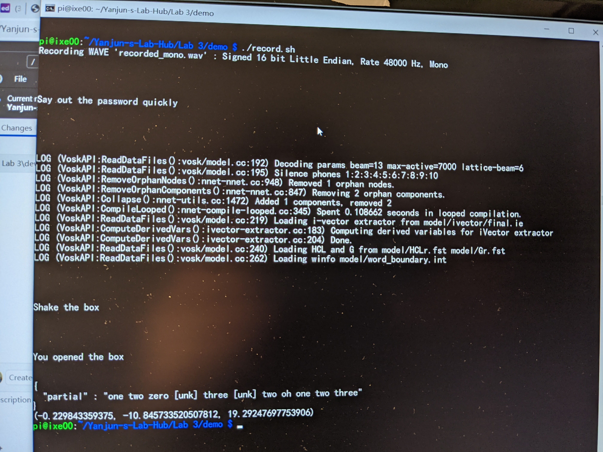
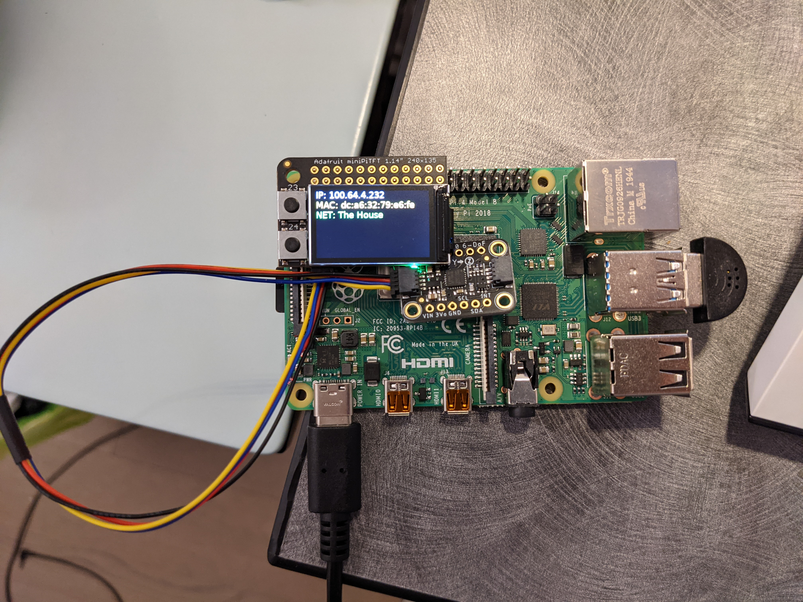

# You're a wizard, [Yanjun]


In this lab, we want you to practice wizarding an interactive device as discussed in class. We will focus on audio as the main modality for interaction but there is no reason these general techniques can't extend to video, haptics or other interactive mechanisms. In fact, you are welcome to add those to your project if they enhance your design.


## Text to Speech and Speech to Text

In the home directory of your Pi there is a folder called `text2speech` containing some shell scripts.

```
pi@ixe00:~/text2speech $ ls
Download        festival_demo.sh  GoogleTTS_demo.sh  pico2text_demo.sh
espeak_demo.sh  flite_demo.sh     lookdave.wav

```

you can run these examples by typing 
`./espeakdeom.sh`. Take some time to look at each script and see how it works. You can see a script by typing `cat filename`

```
pi@ixe00:~/text2speech $ cat festival_demo.sh 
#from: https://elinux.org/RPi_Text_to_Speech_(Speech_Synthesis)#Festival_Text_to_Speech

echo "Just what do you think you're doing, Dave?" | festival --tts

```

You can also play audio files directly with `aplay filename`.

After looking through this folder do the same for the `speech2text` folder. In particular, look at `test_words.py` and make sure you understand how the vocab is defined. Then try `./vosk_demo_mic.sh`

## Serving Pages

In Lab 1 we served a webpage with flask. In this lab you may find it useful to serve a webpage for the controller on a remote device. Here is a simple example of a webserver.

```
pi@ixe00:~/$ python server.py
 * Serving Flask app "server" (lazy loading)
 * Environment: production
   WARNING: This is a development server. Do not use it in a production deployment.
   Use a production WSGI server instead.
 * Debug mode: on
 * Running on http://0.0.0.0:5000/ (Press CTRL+C to quit)
 * Restarting with stat
 * Debugger is active!
 * Debugger PIN: 162-573-883
```
From a remote browser on the same network, check to make sure your webserver is working by going to [http://ixe00.local:5000]()


## Demo

In the [demo directory](./demo), you will find an example wizard of oz project you may use as a template. **You do not have to** feel free to get creative. In that project, you can see how audio and sensor data is streamed from the Pi to a wizard controller that runs in the browser. You can control what system says from the controller as well.

## Optional

There is an included [dspeech](.dspeech) demo that uses [Mozilla DeepSpeech](https://github.com/mozilla/DeepSpeech) for speech to text. If you're interested in trying it out we suggest you create a seperarate virutalenv. 


# Lab 3 Part 2

Create a system that runs on the Raspberry Pi that takes in one or more sensors and requires participants to speak to it. Document how the system works and include videos of both the system and the controller.

## Prep for Part 2

1. Sketch ideas for what you'll work on in lab on Wednesday.

I plan to design a magic box which will only be opened when someone say out the correct password and shake it at the same time. The design consists of the speech to text function and an extended acceleration sensor to detect the movement of the raspberry Pi.

## Share your idea sketches with Zoom Room mates and get feedback

*what was the feedback? Who did it come from?*

Jingjun Wang:

It's reminiscent of ali baba's story where he says  'open sesame' to find hidden treasure. I like the idea that users need to shake it as well, making sure that only the owner can open the box even if other people guess the passwords.

James Wang:

I think this is a good idea, and the interaction seems interesting. It would be nice to have some surprises when the box is "opened" - like some fortune cookie sayings maybe.

Wenqing Tang:

It's a very fun idea. There's no enough details in the description so I'm not sure whether there will be any instructions on the screen for opening the box, but if there's not I'll advice you to add those and also try to let the screen display the words the user says in case they say the right password but the speech-to-text detection is not precise enough to recognize it.

## Prototype your system

The system should:
* use the Raspberry Pi 
* use one or more sensors
* require participants to speak to it. 

*Document how the system works*

Rasperry Pi is simulated as a magic box which can only be opened when someone says the correct password to it and shake the box. The system will first record your voice. After that, it will detect if the participant says out the correct password "one, two, three". The participant also needs to shake the box continuously in this process to let the absolute value of either dimension of 3D-acceleration exceeds 15. 

*Include videos or screencaptures of both the system and the controller.*

Video: https://drive.google.com/file/d/1avhoVp4_L-t6z6tfmpopCItKBOHec4Jm/view?usp=sharing

Controller:


System:


## Test the system
Try to get at least two people to interact with your system. (Ideally, you would inform them that there is a wizard _after_ the interaction, but we recognize that can be hard.)

Answer the following:

### What worked well about the system and what didn't?

The system is a simple and easy design. However, limited by the length of the cable which connects the sensor and the main panel, it's hard for participants to shake the sensor while keeping the panel still. Also according to the feedback from the testees, It's a bit difficult to control the shaking direction of the acceleration sensor. Besides, participants can hardly to recognize what to do for each step as they can only read the hint from the command line and the responding time left for them is not enough. They failed several times and succeeded only after me as the designer gave them instructions. For the speech-to-text recognition part, the installed vosk vocal detection system does not work very well in accuracy. So the password has to be chosen from the 10 numbers and it has to be an easy one.

### What worked well about the controller and what didn't?

The controller is a bit ugly in the apperance as it used the command line to start the python file. But in all, it's just one enter button to start, so it's quite straightforward and easy to use. Disadvantages could be that it doesn't have pause and stop buttons to record the voices separately, which could be very helpful for the participant to say the words on their paces. 

### What lessons can you take away from the WoZ interactions for designing a more autonomous version of the system?

To let the user feel a sense of controlling is very important when designing an autonomous system. We easily neglect any in-process pause or stop functions when our product becomes "autonomous". Also, a debug function and real-time detection of the system or feedback matter a lot. 


### How could you use your system to create a dataset of interaction? What other sensing modalities would make sense to capture?

I can make a dataset consisting of people's vocal speed and their acceleration values of shaking movement. It could probably somewhat reflects the relationship between them that people may speak more fast when they get some time-limited tasks on hand and they may become more anxious. I think for this dataset, no other sensing modalities are needed. 
